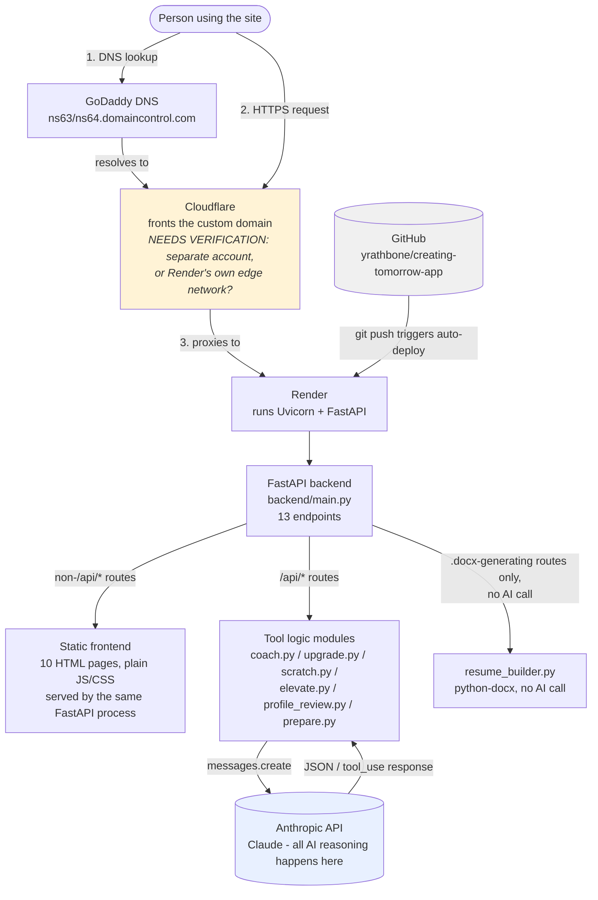
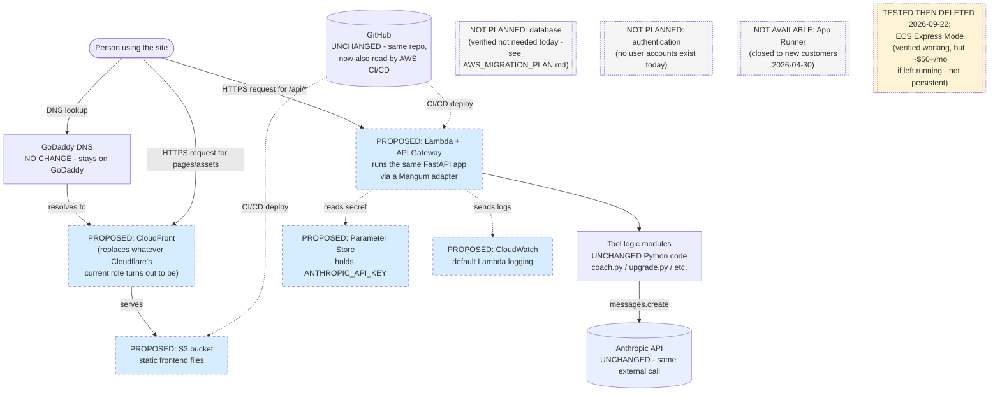

# Creating Tomorrow — Architecture Diagrams

Both diagrams below only include components VERIFIED in
`docs/CURRENT_INFRASTRUCTURE.md`. Nothing is shown because it was discussed
previously — only what was actually confirmed by reading the repo or
checking the live site. The proposed diagram's new pieces are explicitly
labeled `PROPOSED` and nothing has been built.

---

## 1. CURRENT architecture (verified)

**What's deliberately absent from this diagram** (verified, not omitted by
accident): no database, no authentication service, no caching layer, no
message queue, no analytics/tracking service, no file storage service for
user uploads (everything is in-memory per request — see
`CURRENT_INFRASTRUCTURE.md` Section E).

---

## 2. PROPOSED AWS architecture

**Nothing below has been built as a persistent service.** Every AWS box is
explicitly proposed — see `docs/AWS_MIGRATION_PLAN.md` for the full
reasoning behind each choice, including the alternatives that were
considered and why they weren't picked. One exception, noted where it
appears below: Amazon ECS Express Mode was actually built, deployed,
verified working, and deleted on 2026-09-22 as a one-time practice rep —
it is not part of the proposed persistent architecture.

**Updated 2026-09-22:** the backend box changed from AWS App Runner to
Lambda + API Gateway. App Runner stopped accepting new customers as of
2026-04-30 (verified live in the AWS console, not from documentation).

**Legend:** dashed-border blue boxes = proposed AWS components (not built).
Grey dashed boxes = explicitly considered and **not** recommended today,
shown so the absence is a decision, not an oversight. The amber dashed box
(ECS Express Mode) is different from the rest — it's the one thing in this
diagram that was actually built and verified, then deliberately torn down,
rather than never built at all.

**What does NOT change in this proposal:** the Python code in every
`backend/*.py` tool module, the entire `frontend/` folder's HTML/CSS/JS, the
Anthropic API relationship, and the GoDaddy DNS registrar. The migration
targets *where the code runs*, not *what the code does*.
